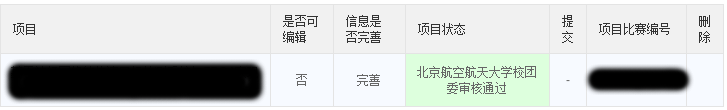

# 冯如杯 $\LaTeX$ 模板 （非官方）

本项目由 [Pannenets.F](https://github.com/PannenetsF) 创建并维护。

## 项目起源

本人曾基于 [Someday-XeLaTex-Template](https://github.com/Somedaywilldo/Someday-XeLaTex-Template) 进行调整，最终完成 [FRB Template](https://github.com/PannenetsF/FRB-Template) ，并且借此通过了学院初审以及学校审核，未出现格式问题。

但是由于该项目未完成类文件 `.cls` ，并且使用大量的 `CJK**` 命令，存在较多的问题，并且在某些时候通过该模板进行基础物理实验报告的重写，出于以上目的对其进行**完全**重构。

## 项目 Flag

1. 完成基本的 `.cls` `.bib` 文件，规范冯如杯格式与引用
2. 提供一些简单的 trick

## License

